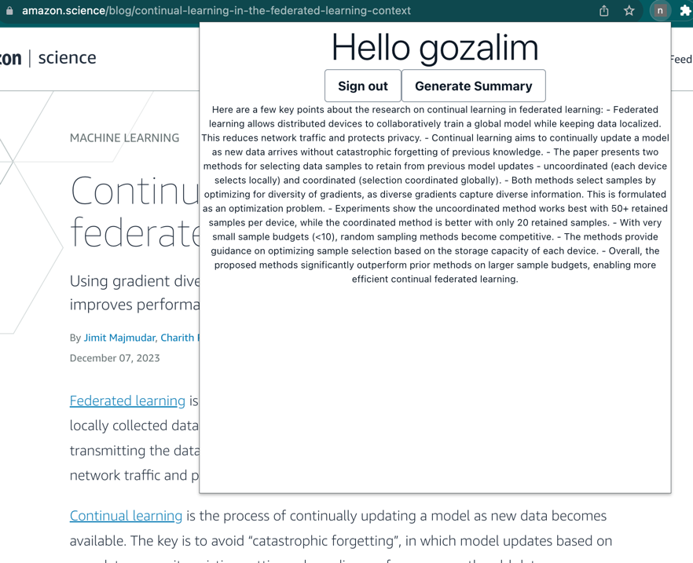

# Google Chrome x AWS Bedrock Extension Summarizer

This project was to learn more about how to program with Chrome's API,
as well as learning more about AWS Bedrock's generative AI capabilities.
It leverages AWS services (Amplify, API Gateway, Lambda, Cognito, and Bedrock) to produce
summaries on https://amazon.science/blog pages.

## Running the project

First you'll need the Amplify CLI: `npm install -g @aws-amplify/cli`.
Next run the command `amplify init --appId YOUR_APP_ID` to connect with your AWS account
Finally running `amplify push` should deploy all the resources accordingly.

### Running the extension locally

Since I'm not so great at React, you'll have to grab the API endpoint created by Amplify and paste it into the
src/App.js file. \
Also, I have never programmed chrome extensions, you'll need to run `npm run build` to webpack bundle the extension
and then import the files directly to chrome (https://support.google.com/chrome_webstore/answer/2664769?hl=en).

### TODO
Yeah... this project is pretty rough around the edges but at least I learned something. When I get around to it, I've got some improvements to make:
* Better layout for the summary text
* Dynamically grab the API endpoint from the amplify exports file (I've got a lot of trouble with this one)
* Add cognito auth to API calls